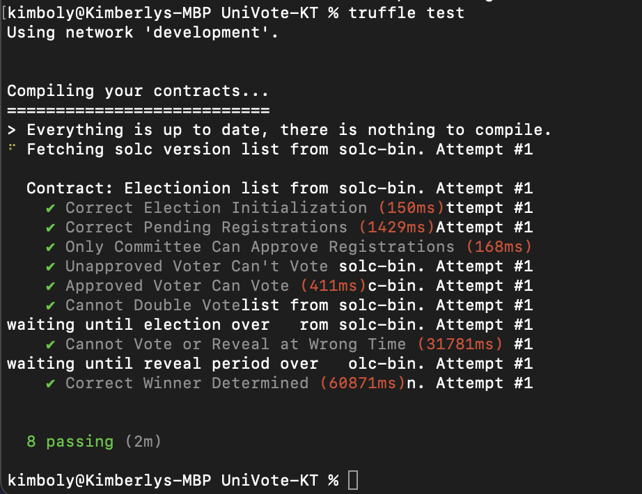

# UniVote

Kimberly Tsao (kt2803), Thomas Lim (tl2977)

UniVote is a secure, on-chain voting dApp that works to make voting on small and large scales more accessible and secure. 

Deployment link: TBA

Demo Video link: TBA

## Testing
To test, clone the git repository and ensure that Truffle Suite is installed. Note that for tests to execute properly, the ```endTime``` parameter in ```2_deploy_contracts.js``` and ```election_test.js``` must be reconfigured according to current UTC time. Also adjust the millisecond parameter to the ```sleep(ms)``` function in the test file according to execution time on your device.

First compile the contract using ```truffle compile```then run tests with ```truffle test```

Here are the results for our testing:


## Security Design
1. In order to maintain real-world feasibility, UniVote expects to work with an accredited election commission to approve voter registrations whether it be by submitting proof-of-identy documents or any other method. We ensure that actions that should only be executed by the commission are properly enforced using ```require``` statements. The exact implmentation of voter verification is left up to discussion and could possibly use a completely decentralized method if employing exclusive NFTs, secret nonces, etc. 
2. ```require``` statements are also used to ensure that only eligible voters may vote in an election. 
3. Our election is implmented as a commit-reveal scheme so that voting actions can be time-controlled and election results wil not be available until after the election is over. The time constraints implmented ensure that a winner will not be declared until both the voting and revealing stages are complete. Allowing results of an election to be available as voting is still happening can be risky especially in scenarios where people could use such information to influence other voters before the voting period ends. 
4. To protect the privacy and identity of voters, we hash votes with a unique salt chosen by the voter. During the reveal period, voters reveal their vote to count the results. At no point does the contract allow others to somehow view what exact candidates a person voted for. This maintains the highest level of privacy seen in national elections as well as still providing voters a method of verifiability. 