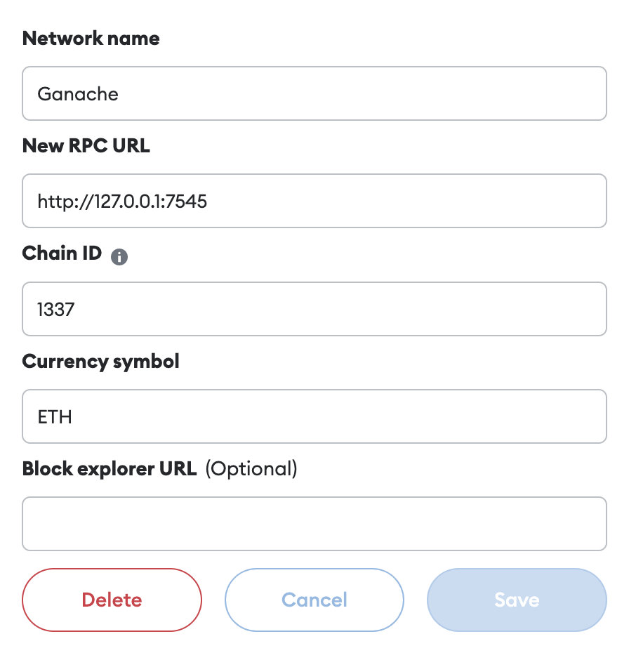

# UniVote

Kimberly Tsao (kt2803), Thomas Lim (tl2977)

UniVote is a secure, on-chain voting dApp that works to make voting on small and large scales more accessible and secure. 

**Deployment info**: [Etherscan Link](https://goerli.etherscan.io/address/0xd0fD675BAf8793B7e1AA90aEA069070A78819009)

&nbsp;&nbsp;&nbsp;Test net: Goerli Testnet

&nbsp;&nbsp;&nbsp;Contract address: 0xd0fD675BAf8793B7e1AA90aEA069070A78819009

**Demo Video link:** [UniVote Google Drive Link](https://drive.google.com/file/d/1KE3Ggzx4zq02iNBI63p_HnUIxmiqN_HZ/view?usp=sharing)

## Testing
To test, clone the git repository and ensure that Truffle Suite is installed. Note that for tests to execute properly, the ```endTime``` parameter in ```2_deploy_contracts.js``` and ```election_test.js``` must be reconfigured according to current UTC time. Also adjust the millisecond parameter to the ```sleep(ms)``` function in the test file if needed according to execution time on your device.

Running the tests near the end of the election period will ensure that the revealVote and calcWinner tests are executed at the right time. The sleep function ensures that the calcWinner test is run after the reveal period has ended.

First compile the contract using ```truffle compile```then run tests with ```truffle test```

Here are the results for our testing:


## Usage
UniVote is deployed on the Goerli Testnet. Since we are not able to pay for hosting, you can interact with the contract via a browser locally with the following instructions.
1. Ensure you have cloned the repository, installed Truffle Suite, and Ganache to provide test wallets and ETH.
2. Set the ```endTime``` and ```revealDuration``` parameter in ```2_deploy_contracts.js```.
3. Install the Metamask extension and add the Ganache Ethereum client as a new network. Import as many wallet addresses as you would like to use. Please note that Account 1 will be the address of the committee as Truffle will deploy from that address. [Helpful instructions](https://trufflesuite.com/docs/truffle/how-to/truffle-with-metamask/)

Network Configuration:



4. Add wallet addresses to accounts.json. Make sure the committee address has the idx 0.
5. Run the following commands to compile, deploy, and start your local web server. 
```
truffle compile
truffle migrate --reset
npm run dev
```

## Security Design
1. In order to maintain real-world feasibility, UniVote expects to work with an accredited election commission to approve voter registrations whether it be by submitting proof-of-identy documents or any other method. We ensure that actions that should only be executed by the commission are properly enforced using ```require``` statements. The exact implmentation of voter verification is left up to discussion and could possibly use a completely decentralized method if employing exclusive NFTs, secret nonces, etc. 
2. ```require``` statements are also used to ensure that only eligible voters may vote in an election. 
3. Our election is implmented as a commit-reveal scheme so that voting actions can be time-controlled and election results wil not be available until after the election is over. The time constraints implmented ensure that a winner will not be declared until both the voting and revealing stages are complete. Allowing results of an election to be available as voting is still happening can be risky especially in scenarios where people could use such information to influence other voters before the voting period ends. 
4. To protect the privacy and identity of voters, we hash votes with a unique salt chosen by the voter. During the reveal period, voters reveal their vote to count the results. At no point does the contract allow others to somehow view what exact candidates a person voted for. This maintains the highest level of privacy seen in national elections as well as still providing voters a method of verifiability. 
5. For better user interaction, we provide client-side validation that is equivalent to some of the ```require``` statements in the smart contract. For example, if a user attempts to submit a vote without having their registration approved or outside of the voting window, an alert will appear on the screen and the action will not be executed. This also saves gas on the user's part for faulty transactions that will fail once confirmed.
